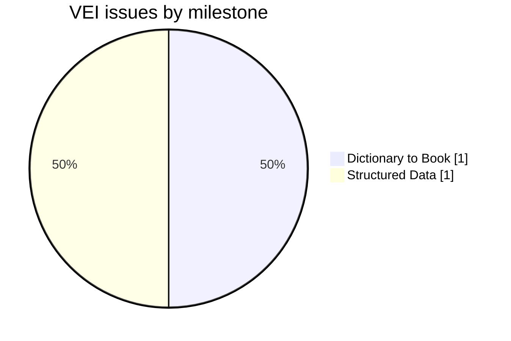
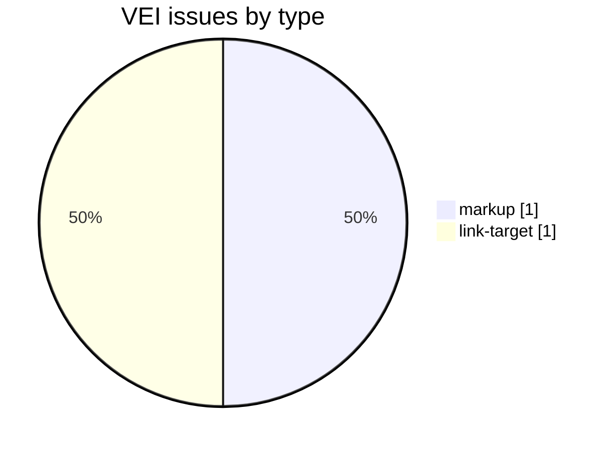
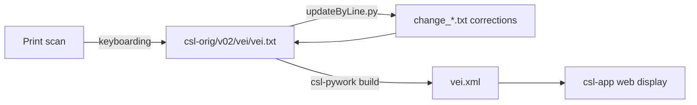

# VEI — Macdonell & Keith *Vedic Index of Names and Subjects* (1912)

_Created: 16-05-2026 · Last updated: 11-07-2026_

Development and correction repository for **A. A. Macdonell and A. B. Keith's *Vedic Index of Names and Subjects***, a specialized index of names and subjects in Vedic literature, part of the [Cologne Digital Sanskrit Lexicon](https://www.sanskrit-lexicon.uni-koeln.de/) (CDSL). The canonical source text lives in [csl-orig/v02/vei/vei.txt](https://github.com/sanskrit-lexicon/csl-orig/blob/main/v02/vei/vei.txt) (3,704 index entries); this repository holds the development, correction, and enrichment work.

An encyclopaedic index of Vedic names and subjects rather than a general dictionary; uses per-page footnote markup.

## Documentation

- [CLAUDE.md](https://github.com/sanskrit-lexicon/VEI/blob/main/CLAUDE.md) — repository guide and data-format reference.
- [DATA_DICTIONARY.md](https://github.com/sanskrit-lexicon/VEI/blob/main/DATA_DICTIONARY.md) — markup tag reference.
- [CONTRIBUTING.md](https://github.com/sanskrit-lexicon/VEI/blob/main/CONTRIBUTING.md) · [CODE_OF_CONDUCT.md](https://github.com/sanskrit-lexicon/VEI/blob/main/CODE_OF_CONDUCT.md)
- Corrections follow the canonical Cologne workflow — see [csl-corrections/docs/correction-workflow.md](https://github.com/sanskrit-lexicon/csl-corrections/blob/main/docs/correction-workflow.md).

## Timeline

| Period | Activity |
|---|---|
| 2025 | Repository activity begins (first tracked issues) |
| 2026-05 | Issue taxonomy, citation metadata, documentation |
| 2026-06 | Front-matter OCR + Russian translation of the prefaces |

## Projects & Milestones

| Milestone | Open | Closed | Total |
|---|---|---|---|
| Dictionary to Book | 1 | 0 | 1 |
| Digitization Quality | 0 | 0 | 0 |
| Structured Data | 0 | 1 | 1 |
| Major Enhancements | 0 | 0 | 0 |
| **Total** | **1** | **1** | **2** |


```mermaid
pie showData
  title VEI issues by milestone
  "Dictionary to Book" : 1
  "Structured Data" : 1
```

## Issues


```mermaid
pie showData
  title VEI issues by type
  "markup" : 1
  "link-target" : 1
```

### Open

| # | Title | Type | Severity | Milestone |
|---|---|---|---|---|
| [1](https://github.com/sanskrit-lexicon/VEI/issues/1) | Links to Panini | link-target | medium | Dictionary to Book |

### Solved

| # | Title | Type | Severity | Milestone |
|---|---|---|---|---|
| [2](https://github.com/sanskrit-lexicon/VEI/issues/2) | [markup] Minor vei.txt Markup Oddities | markup | minor | Structured Data |

## Labels

### Type labels

| Label | Meaning |
|---|---|
| `link-target` | Click-throughs from `<ls>` abbreviations to scanned PDF pages |
| `link-splitting` | Splitting combined `SOURCE N,N` refs into per-page links |
| `markup` | Normalising XML tag content |
| `text-correction` | Corrections to English/Sanskrit definitions or headwords |
| `content-enhancement` | New material or structural additions beyond correction |
| `encoding` | SLP1/IAST transcoding, character normalisation |
| `scan-quality` | Replacing blurry/skewed/missing scan pages |
| `bug` | Broken links, XML errors, broken downloads |
| `question` | Scholarly questions requiring research |

### Severity labels

| Label | Meaning |
|---|---|
| `minor` | Targeted fix — a handful of lines or a single file |
| `medium` | Standard unit of work — one batch of corrections |
| `hard` | Large effort spanning many sources or files |

## Contributors

Repository git history (source-text keyboarding of `vei.txt` itself is maintained upstream in [csl-orig](https://github.com/sanskrit-lexicon/csl-orig) by the Cologne team, incl. funderburkjim and drdhaval2785):

| Contributor | Commits |
|---|---|
| gasyoun (Mārcis Gasūns) | 24 |
| dependabot[bot] | 1 |

## Source

- **Author**: Macdonell, A. A.; Keith, A. B.
- **Title**: *Vedic Index of Names and Subjects*
- **Place / Publisher**: London: John Murray
- **Year(s)**: 1912
- **Volumes**: 2
- **Language pair**: Sanskrit (Vedic) → English
- **Size (CDSL headword index)**: 3,704 index entries
- **License (digital edition)**: CC BY-SA 4.0
- See [CITATION.cff](https://github.com/sanskrit-lexicon/VEI/blob/main/CITATION.cff) for machine-readable citation.

## Encoding

- UTF-8 (NFC) throughout.
- Sanskrit text in SLP1 transliteration, wrapped in `{#…#}`; English gloss / italic display text in ``.
- Devanāgarī and IAST display forms are generated at display time, not stored in the source.

## Usage example

Applying a correction to the real first entry of [vei.txt](https://github.com/sanskrit-lexicon/csl-orig/blob/main/v02/vei/vei.txt) with `updateByLine.py` (see the canonical [correction workflow](https://github.com/sanskrit-lexicon/csl-corrections/blob/main/docs/correction-workflow.md)). The real current line 9 (entry 1, headword `aMSu`) reads:

```
{@Aṃśu.@}¦ — I. Name of a protégé of the Aśvins in the Rigveda.<sup>1</sup>
```

A change file pairs the old/new lines by line number (illustrating a hypothetical footnote-marker fix, moving `<sup>1</sup>` after the period):

```
; change_vei_example.txt
9 old {@Aṃśu.@}¦ — I. Name of a protégé of the Aśvins in the Rigveda.<sup>1</sup>
9 new {@Aṃśu.@}¦ — I. Name of a protégé of the Aśvins in the Rigveda<sup>1</sup>.
```

```sh
python updateByLine.py vei.txt change_vei_example.txt vei_corrected.txt
```

Illustrative only (no such correction is queued) — the "before" line is the real, current `csl-orig/v02/vei/vei.txt` line 9.

## How it works


```mermaid
flowchart LR
  S["Print scan"] -->|keyboarding| O["csl-orig/v02/vei/vei.txt"]
  O -->|updateByLine.py| C["change_*.txt corrections"]
  C --> O
  O -->|csl-pywork build| X["vei.xml"]
  X --> A["csl-app web display"]
```

## Repository contents

| Path | What it is |
|---|---|
| [prefaces/](https://github.com/sanskrit-lexicon/VEI/tree/main/prefaces) | Front-matter OCR (title, foreword, preface, map) of the Vedic Index, with Russian translations — see [Front matter](#front-matter-prefaces) below |
| [vei.xml](https://github.com/sanskrit-lexicon/VEI/blob/main/vei.xml) | Generated CDSL XML build of the index |
| [make_xml.py](https://github.com/sanskrit-lexicon/VEI/blob/main/make_xml.py) | Helper for the XML build step |

## Front matter (`prefaces/`)

The [prefaces/](https://github.com/sanskrit-lexicon/VEI/tree/main/prefaces) folder holds a faithful OCR of the front matter of the **Vedic Index of Names and Subjects** (A. A. Macdonell & A. B. Keith; Foreword by Dr. Sampurnanand; Motilal Banarsidass, Varanasi, 2 vols., Preface signed *Oxford, July 18, 1912*).

- **Source:** Cologne Digital Sanskrit Lexicon scans — [veipref.html](https://sanskrit-lexicon.uni-koeln.de/scans/csldev/csldoc/build/dictionaries/prefaces/veipref.html)
- **Source language: English.** Base pages `veiprefNN.md` are the English text (no `.en.md`); each page has a Russian translation `veiprefNN.ru.md`.
- **Consolidated editions:** [prefaces/veipref_all.en.md](https://github.com/sanskrit-lexicon/VEI/blob/main/prefaces/veipref_all.en.md) (English) and [prefaces/veipref_all.ru.md](https://github.com/sanskrit-lexicon/VEI/blob/main/prefaces/veipref_all.ru.md) (Russian), built reproducibly by [prefaces/build_combined.py](https://github.com/sanskrit-lexicon/VEI/blob/main/prefaces/build_combined.py).
- **Index:** [prefaces/README.md](https://github.com/sanskrit-lexicon/VEI/blob/main/prefaces/README.md) — per-page contents table, signatures/dates, and run notes.
- 16 pages: Title (1), Foreword 1–2, Preface 1–12, Map of Vedic India (vol. 2). Digitizer running header/footer stamps were omitted from each transcription.

| Date | Change |
|---|---|
| Jun 2026 | Front-matter OCR + Russian translation of the prefaces (`prefaces/`) |

---
*Issue taxonomy and documentation per the [Cologne issue runbook](https://github.com/sanskrit-lexicon/csl-observatory/blob/main/runbook/cologne-issue-runbook.md).*

_Dr. Mārcis Gasūns_
